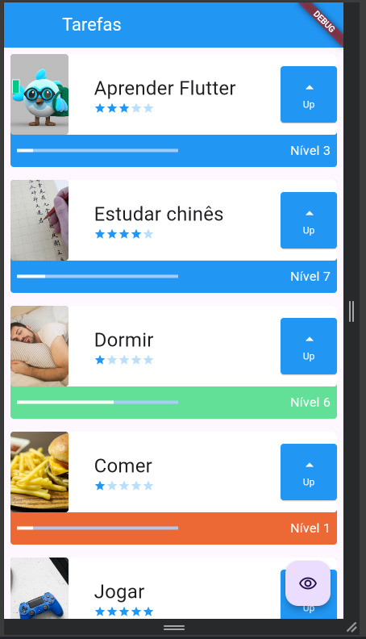
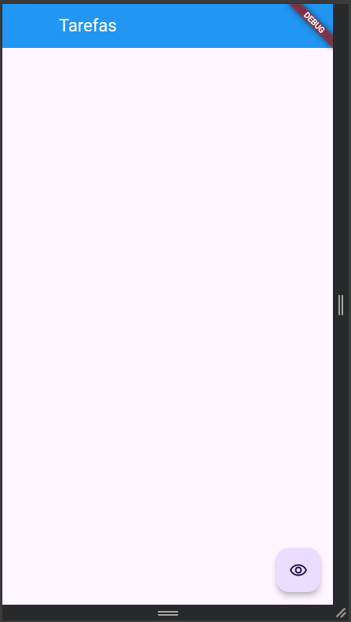

# Primeiro projeto em flutter

Aqui foi feita uma simples tela com alguma tarefas postas de forma mockada, tendo imagem, nome, grau de dificuldade e um progresso de nível junto de um botão que ao ser clicado eleva o progresso da tarefa e ao atingir o nível máximo obtemos uma maestria que muda a cor da tarefa, dizendo que estamos em grau elevado. Além disso, também temos um botão que gera uma animação de fade in / fade out na tela. 

## Conceitos e elementos

Nesse projeto foi estudado e aplicado os seguintes conceitos e elementos:

- Stateless e Stateful Widget
- Container
- Stack
- Row
- Column
- BoxDecoration
- ElevatedButton
- FloatingButton
- setState
- AnimatedOpacity
- Icons
- AppBar
- Scaffold
- Child/Children
- Padding
- Text
- LinearProgressIndicator
- Image

Após clicar no FloattingButton

